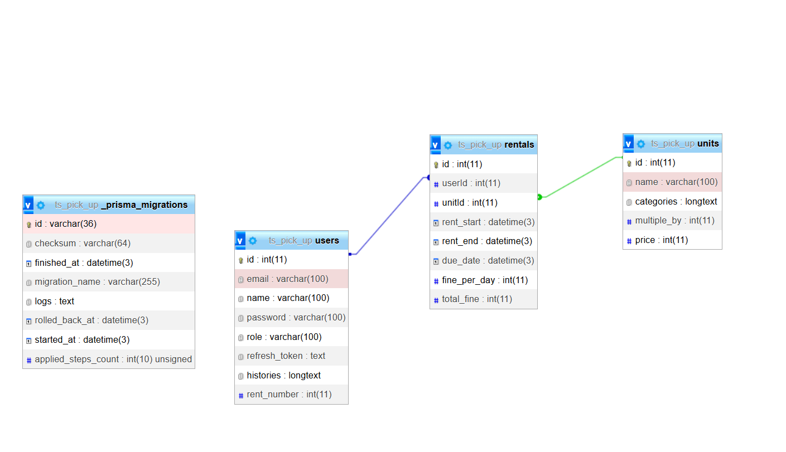

# Kelompok OSS
## Anggota 
Eri Satrio Nusantara
## Deskripsi backend 
Project ini adalah bagian backend dari sistem penyewaan mobil pick up. 
## List fitur 
1. Autentikasi dengan JWT (refresh token dan access token).
2. Terdapat dua role yaitu Admin dan Anggota.
3. Anggota bisa meminjam mobil pick up tidak lebih dari 2 mobil.
4. Anggota harus menghubungi Admin untuk pengembalian mobil.
5. Terdapat validasi di sisi backend dengan Zod.
6. Untuk penggunaan API bisa lihat folder doc
7. Berikut adalah link front-end = https://github.com/erisatrio1/pick-up-typescript-backend

## DB Schema
